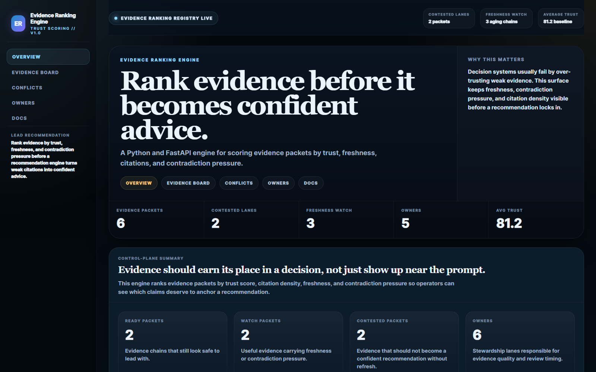
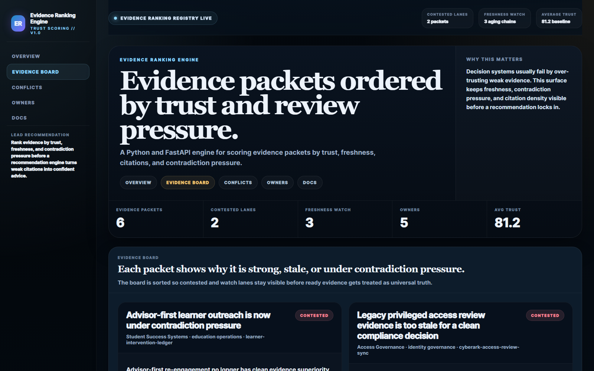
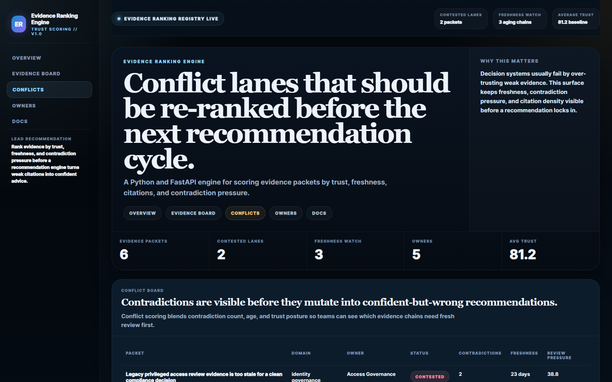
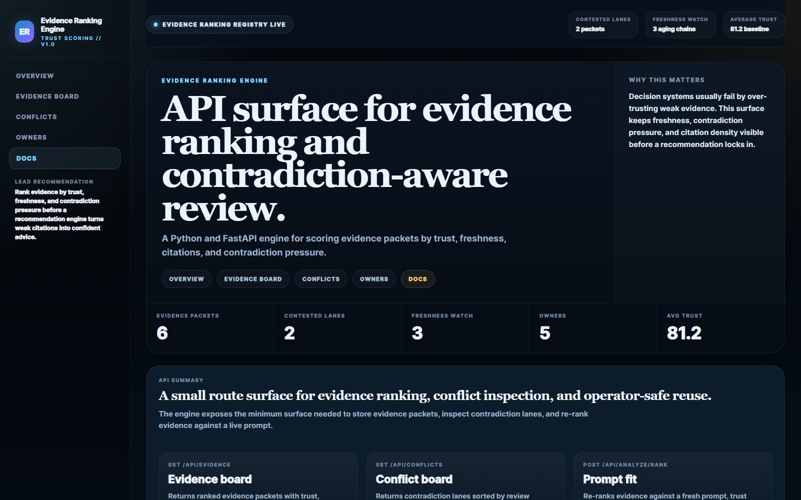

# Evidence Ranking Engine

Python and FastAPI engine for ranking evidence packets by trust, freshness, citation density, and contradiction pressure before recommendations become executive-facing advice.

## Why it matters

Decision systems usually fail by over-trusting stale or weakly cited evidence. This repo turns evidence quality into an operator-visible surface: which packets are safe to lead with, which ones are aging, and which ones are under contradiction pressure before a recommendation chain hardens around them.

## Screenshots






## What it does

- ranks evidence packets across trust score, citation depth, freshness, and contradiction count
- exposes conflict lanes that need review before a decision memo inherits them
- shows owner stewardship lanes for evidence quality upkeep
- provides a prompt-fit API to re-rank evidence against a fresh operating question

## Local run

```powershell
Set-Location "C:\Users\chaus\dev\repos\evidence-ranking-engine"
py -3.11 -m venv .venv
.\.venv\Scripts\python.exe -m pip install -r requirements.txt
.\.venv\Scripts\python.exe -m app.main
```

If `5026` is already taken:

```powershell
$env:PORT = "5031"
.\.venv\Scripts\python.exe -m app.main
```

Then open:

- `http://127.0.0.1:5026/`
- `http://127.0.0.1:5026/evidence-board`
- `http://127.0.0.1:5026/conflicts`
- `http://127.0.0.1:5026/owners`
- `http://127.0.0.1:5026/docs`

## Validation

```powershell
.\.venv\Scripts\python.exe -m unittest discover -s tests
.\.venv\Scripts\python.exe scripts\run_demo.py
.\.venv\Scripts\python.exe scripts\smoke_check.py
.\.venv\Scripts\python.exe scripts\render_readme_assets.py
```

## API routes

- `GET /api/dashboard/summary`
- `GET /api/evidence`
- `GET /api/evidence/{evidence_id}`
- `GET /api/conflicts`
- `GET /api/owners`
- `GET /api/sample`
- `POST /api/analyze/rank`

## Repo layout

- `app/main.py` FastAPI routes and API surface
- `app/services/evidence_ranking_service.py` ranking, conflict scoring, and owner lane logic
- `app/render.py` HTML control surfaces and static proof generation
- `app/data/sample_evidence_data.py` seeded evidence packets and dashboard data
- `docs/architecture.md` system structure and ranking model
- `docs/ORIGIN.md` why the product exists
